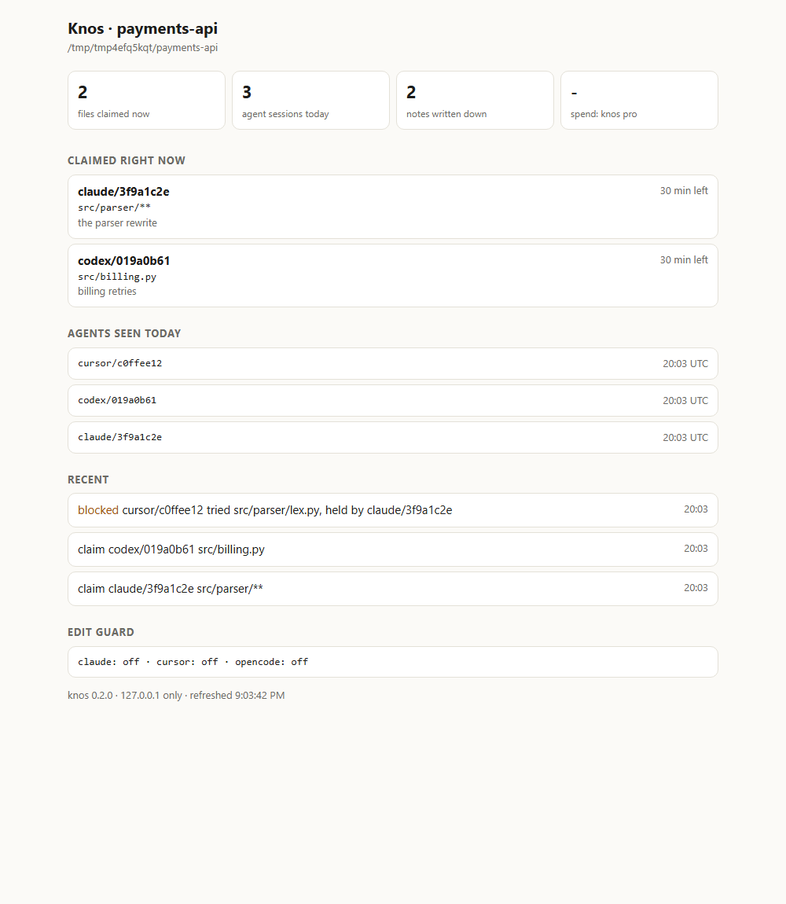

# Knos

**One memory and one claim list for every coding agent on your machine, and a cap on what they spend.**

```
$ pipx install knos && knos init
  + read this repo into Sibyl memory: 212 commits, 38 things said in past sessions
  + Claude Code: memory server, edit guard and session notice
  + Codex: memory server
  + Cursor: memory server, edit guard and session notice
  Self-test passed: the memory server answered with its four tools and the guard allowed an empty edit.
  Try it:  knos ask "what did we decide about auth?"   or   knos demo
```

(The counts are your repo's. `knos init` takes under 30 seconds, measured by `knos bench`.)



*`knos board`, rendered from a demo repo's real claims and refusal. It runs on 127.0.0.1 only, with a one-off token.*

## The three things it fixes

1. **Agents collide.** Two sessions, from the same vendor or different ones, edit the same files, and work is lost or
   done twice.
   - With Knos, session A claims `src/parser/**`.
   - When session B tries to edit `src/parser/x.py`, it is refused in one line that names who holds the file and since
     when.
   - A's own edits are never blocked.
2. **Agents forget.** Every session rediscovers what earlier sessions, other vendors' agents and past commits already
   settled.
   - Knos reads all of them into one [Sibyl](https://sibyllabs.org) memory.
   - Any agent asking "why did we drop the retry queue?" gets the answer with its citation: the Codex session, the
     Cursor chat or the commit.
3. **Agents spend with no edge** (Knos Pro).
   - Knos meters what Claude Code and Codex spend, from their own logs, with no proxy.
   - One cap covers every agent, session and host: when it is reached, the next edit is refused in one line.
   - An agent that pays for APIs itself (MPP on Tempo, x402 on Solana) pays from its **own** wallet, which holds only
     what you funded it with. The chain enforces that ceiling even if Knos is bypassed.

## What it runs on

- **[Sibyl](https://sibyllabs.org)** is the memory engine: every answer Knos gives comes out of a Sibyl store. Sibyl's
  free tier holds 5 MB, and Knos never patches or routes around that cap. It keeps what can be rebuilt out of the
  store, warns at 80%, and offers `knos compact`, or `sibyl upgrade` for Sibyl Pro (no cap).
- **Solana** carries Pro licences, paid with a Solana Pay USDC link and verified by the CLI against the chain. There
  is no licence server and no payment processor, and it works from any country. Solana also holds agent budget wallets
  for x402 payments.
- **Tempo** does the same with a stablecoin `transferWithMemo`, and holds agent wallets for MPP payments (the protocol
  Stripe and Tempo co-authored).

Memory, claims and the guard work fully offline. The chains carry money and proof.

**Headroom on Sibyl's free 5 MB**, measured 29 Sep 2026 after reading each repo's latest 400 commits and its rules:

| repo | store | counted by Sibyl's cap |
|---|---|---|
| django | 2.0 MB | 2.3 MB |
| hermes-agent | 3.0 MB | 3.3 MB |

Sibyl's count includes your own Sibyl memory in `~/.sibyl-memory`. Past sessions add to the store as they are read.
Knos warns at 80%.

## Install

Python 3.10+ on Windows, macOS or Linux:

```
pipx install knos        # or: uv tool install knos
knos init                # wire every agent it finds; undo with: knos init --undo
```

Optional extras:
- `pipx inject knos 'knos[pro]'` adds licence codes and a terminal QR.
- `pipx inject knos 'knos[agentpay]'` adds agent payments over MPP and x402 (MPP needs Python 3.11+).

## Use it

| you type | what happens |
|---|---|
| `knos ask "why did we drop redis?"` | answers from past sessions (Claude Code, Codex, Cursor), commits, CLAUDE.md/AGENTS.md and the code, each with its source |
| `knos claim "the parser" -p "src/parser/**"` | other agents' edits to those files are refused until `knos done` or the claim lapses |
| `knos status` / `knos board` | what is claimed and by whom, what memory holds; `board` is a live page on 127.0.0.1 |
| `knos demo` | the whole product on a throwaway repo, with every line a real call |
| `knos spend` / `knos budget set 20 --per day` | Pro: spend at API list prices, and one cap over everything |
| `knos budget fund --agent claude 5 --chain tempo` | Pro: that agent's own wallet; it pays APIs with `knos pay` or the `pay` tool |
| `knos pro buy` | pay for Pro with USDC on Solana (or `--chain tempo`), checked on chain |
| `knos serve` + `knos init --remote <url> --token <t>` | Team: one claim list, shared notes and one spend cap across every machine that joins; a claim on one machine blocks an edit on another |

Your agents use the same things through the MCP server `knos init` installs, which has five tools:
- `search` and `about` (answers, annotated with who holds which files; nothing is hidden);
- `remember` (with `claiming=true, paths=[...]` to claim files);
- `done`;
- `pay` (Pro).

The edit guard runs in Claude Code's and Cursor's pre-edit hooks and in an OpenCode plugin. Codex has no edit hook,
so its edits are not guarded. Edits made with shell commands (`sed -i`, scripts) are not seen by any of these hooks.

## Numbers

From [`knos bench`](docs/BENCH.md), which anyone can re-run:

| | knos | without |
|---|---|---|
| rounds where a conflicting edit reached the file (3 agents, 200 rounds) | **0** | 191 with advisory leases (simulated); 200 with no coordination |
| questions answered from past sessions and commits, with a citation (20) | **18** | 0 with CLAUDE.md alone |
| steps to three hosts sharing memory and claims | **1** | 8 ([COMPARE.md](docs/COMPARE.md)) |
| spend past an agent's cap (200 attempted payments) | **0** | |
| edit-guard decision, p95 (5,400 files) | **38.8 ms** | |
| search, p95 (5,400 files) | **25.9 ms** | |
| `knos init`, 4 hosts, self-test included | **21 s** | |

Measured 29 Sep 2026 on a Linux (WSL) laptop with a spinning disk; your numbers will differ, so run `knos bench`.

Verify the core claims yourself:
- `pytest tests/test_collide.py`: exactly one of many agents gets a file.
- `pytest tests/test_no_network.py`: a whole day of work opens no network connection.
- `pytest tests/test_v1_fixes.py`: one test per defect fixed in 0.2.0.

## Privacy

Nothing leaves your machine. Knos reads your repo, your agents' local transcripts and their spend logs, and writes
to `~/.knos`. The only network traffic is what Knos Pro does when you ask it to:
- public RPC reads to check a payment;
- payments you or your agent's wallet sign;
- with Knos Team, claims, notes and spend totals sent to the `knos serve` you host, and to nobody else;
- for Sibyl Pro subscribers only, Sibyl's own tier check at its size cap.

Secrets (`.env`, keys, certificates, `.ssh`, `.aws`, and paths you add with `knos private`) never reach your agents.

## Plans

- **Free (MIT):** memory, claims and the guard, everywhere, forever.
- **Pro:** 10 USDC for 30 days, or 100 a year, with a 14-day trial.
- **Team:** 20 USDC per seat per 30 days, with the self-hosted `knos serve`.

See [PRICING.md](PRICING.md).

## History

- **0.1.x:** released 1–7 Sep 2026.
- **0.2.0:** built 29 Sep – Oct 2026 (see [CHANGELOG.md](CHANGELOG.md)).

Knos was built by drexthealpha. Its memory engine is [Sibyl](https://sibyllabs.org).
